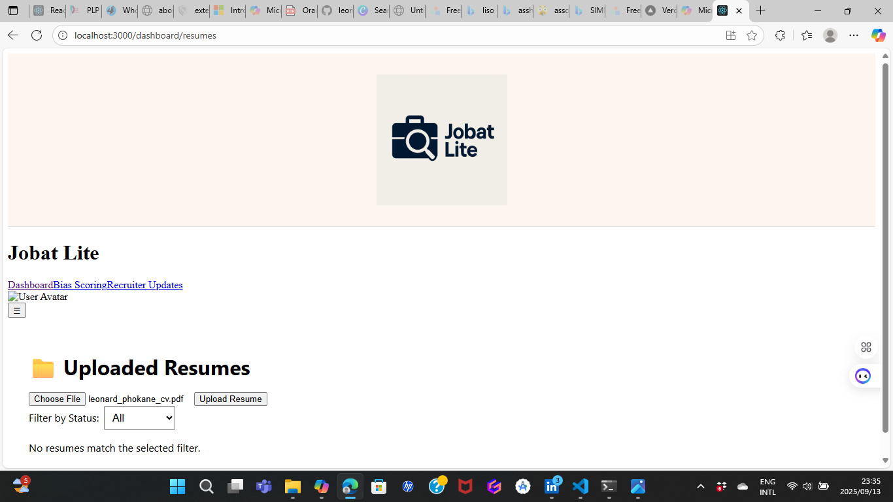

# 🧠 Jobat Lite — FNB Hackathon Submission

---

## 🚀 Overview

**Jobat Lite** is a recruiter-facing resume dashboard designed to promote ethical hiring through automation, bias scoring, and real-time recruiter insights. Built for speed, clarity, and fairness, it empowers hiring teams to make informed decisions while reducing unconscious bias.

---

## 🎯 Key Features

- 📤 **Resume Upload & Parsing**  
  Upload resumes and extract structured data instantly.

- ⚖️ **Bias Scoring Panel**  
  Analyze resumes for potential bias indicators using fairness metrics.

- 📬 **Recruiter Updates**  
  Track outreach and engagement with candidates.

- 📁 **Resume History Dashboard**  
  View, filter, and manage uploaded resumes with status tracking.

- 🔍 **Status Filtering & Pagination**  
  Easily navigate large datasets with built-in filters and pagination.

---

## 🛠️ Tech Stack

| Frontend        | Backend         | Database     | Realtime      |
|----------------|-----------------|--------------|---------------|
| React.js        | Express.js      | MongoDB      | Socket.io     |

- Tailwind CSS for styling
- Toastify for notifications
- Modular architecture for scalability

---

## 📦 Getting Started

### 🔧 Backend Setup

cd jobat-lite-backend
npm install
npm run dev
💻 Frontend Setup
bash
cd jobat-lite-dashboard
npm install
npm start

---

🌐 Deployment
This project is deployed on Netlify for frontend and Render (or similar) for backend.

🔗 [Live Demo](https://jobat-lite-dashboard.netlify.app)

🛡️ _redirects file included for React Router support

---

🧬 Legacy Impact
Jobat Lite was built to support:

Ethical hiring practices

Afro-futurist empowerment

Recruiter clarity and accountability

---

📁 Repo Structure
Code
jobat-lite/
├── jobat-lite-backend/       # Express + MongoDB API
├── jobat-lite-dashboard/     # React frontend
├── assets/                   # Screenshots and media
├── README.md                 # Project documentation

---

🔥 Extras
✅ Screenshot preview in README

✅ Netlify deployment with routing support

✅ Modular components for easy extension

✅ GitHub auto-deploy enabled

---
🏷️ Tags
fnb-hackathon ethical-ai recruiter-dashboard bias-scoring react-express

---

🤝 Contributors
Leonard Phokane — Fullstack Developer